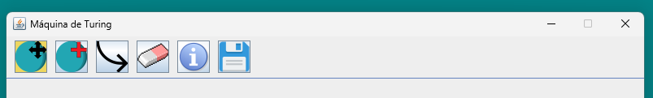
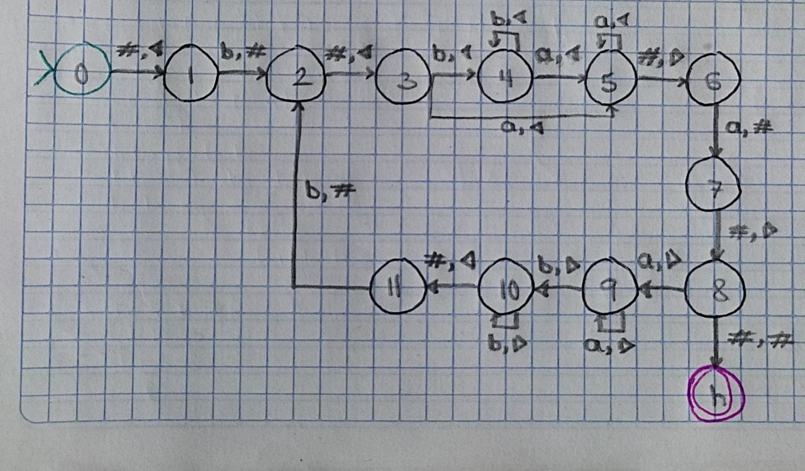
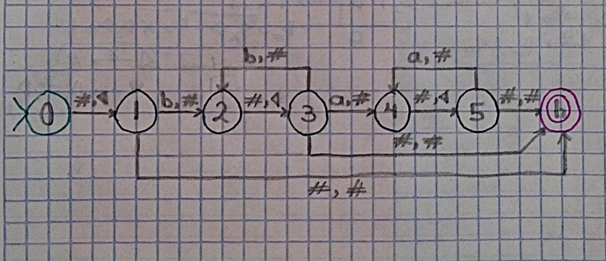

**Turing Machine GUI**

---

**Some Basics**

**Formal Languages:**
Formal languages are essential in computer science and mathematics for describing patterns and structures. They provide a precise way to define sets of strings over a given alphabet. These languages are used in various areas of computer science, including compiler design, artificial intelligence, and cryptography.

**Automata:**
Automata are abstract mathematical models used to describe computation. They consist of states, transitions, and input symbols. Finite automata, pushdown automata, and Turing machines are examples of automata used to recognize different classes of languages.

**Turing Machines:**
Turing machines are a fundamental concept in computability theory and the theory of computation. They are theoretical devices that manipulate symbols on an infinite tape according to a set of rules. Turing machines can simulate any algorithmic process and are used to understand the limits of computability.

---

**Description:**

This application is a Turing Machine Simulator, allowing users to visually design Turing Machines. It provides an intuitive graphical interface for users to create state and transitions of Turing Machines.

**Why a Tool for Formal Languages and Automata is Useful:**
Understanding formal languages and automata theory is crucial for students and professionals in computer science and related fields. However, manually designing automata can be time-consuming.

The tool I developed provides a user-friendly interface for designing and analyzing automata. It allows users to create Turing machines effortlessly.

By simplifying the process of working with automata and formal languages, this tool enables users to focus more on understanding the underlying concepts and exploring their applications in various domains of computer science. Whether you're a student learning about automata theory for the first time or a researcher investigating new computational models, this tool provides a valuable resource for experimentation and learning.

---

**Features:**

1. **Graphical Interface:** The application features a graphical interface where users can visually design Turing Machines. The main window consists of a drawing panel where states and transitions are displayed.

2. **State Management:** Users can add, delete, and move states on the drawing panel. States are represented by circular nodes, and users can interact with them to define their properties.

3. **Transition Creation:** Users can create transitions between states by specifying the read and write symbols, as well as the direction of movement. Transitions are represented by arrows between states.

4. **Save:** Users can save their Turing Machine designs to a file (where all the states and transitions are described) for later use.

---

**How to Use:**

This is the appearance of the toolbar.

**The available actions are listed in the order they appear on display.**

1. **Move:** Click the "Move Circle" button to move any existing state in the drawing panel. States are represented by circular nodes.

1. **Adding States:** Click the "Add Circle" button to add a new state to the drawing panel. States are represented by circular nodes.

1. **Creating Transitions:** Click the "Arrow" button to create transitions between states. Specify the read and write symbols, as well as the direction of movement.

1. **Delete States:** Use the "Eraser" button to delete states or transitions.

1. **Set/Edit Transition Values:** Click the "Info" button, then click the state wich transitions are needed to be changed to enter into edition mode.

1. **Saving:** Use the "Save" and "Load" buttons to save your Turing Machine design to a file or load a previously saved design.

---

**Examples: (Hand Written/Softaware made / output)**

<table>
  <tr>
    <td></td>
    <td></td>
    <td><pre><code></code>0,#,1,i
1,b,2,#
2,#,3,i
3,b,4,i
4,a,5,i
5,#,6,d
6,a,7,#
7,#,8,d
8,a,9,d
9,b,10,d
10,#,11,i
11,b,2,#
4,b,4,i
5,a,5,i
10,b,10,d
9,a,9,d
8,#,h,#
3,a,5,i</pre></td>
  </tr>
  <tr>
    <td></td>
    <td></td>
    <td><pre><code></code>0,#,1,i
1,b,2,#
1,#,h,#
2,#,3,i
3,b,2,#
3,#,h,#
3,a,4,#
4,#,5,i
5,#,h,#
5,a,4,#
</pre></td>
  </tr>
  <tr>
    <td></td>
    <td></td>
    <td><pre><code></code>0,#,1,i
1,a,2,#
1,b,2,#
1,#,h,#
3,#,h,#
3,b,2,#
3,a,2,#
2,#,3,i
</pre></td>
  </tr>
</table>
