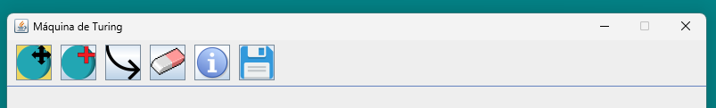
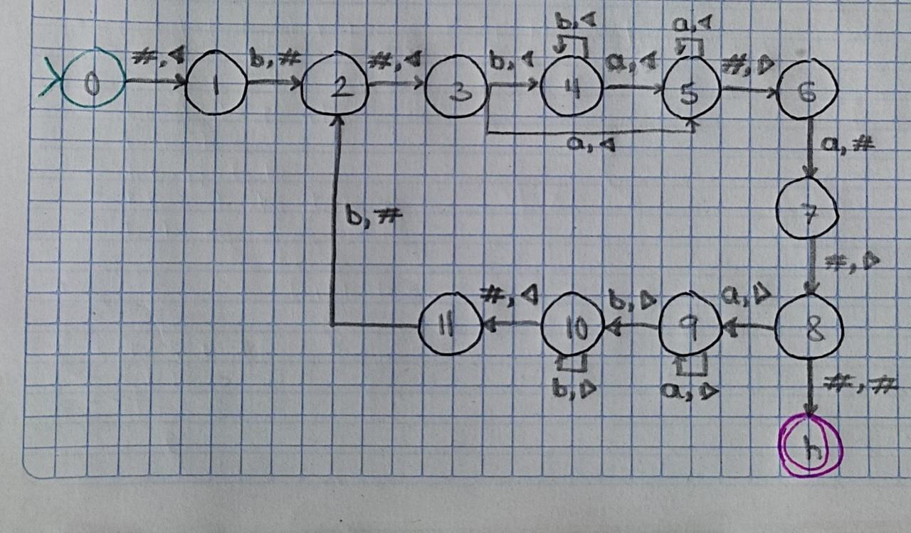
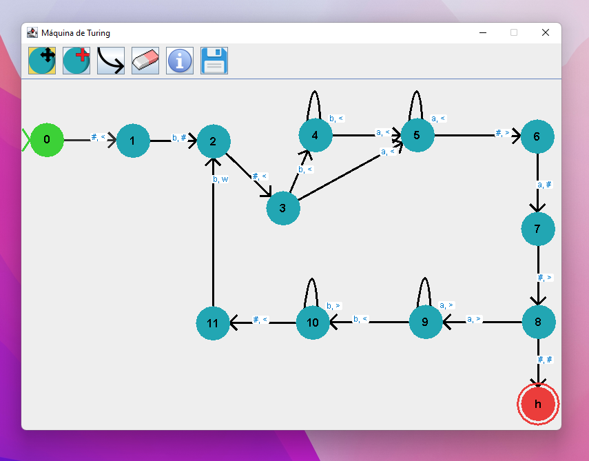
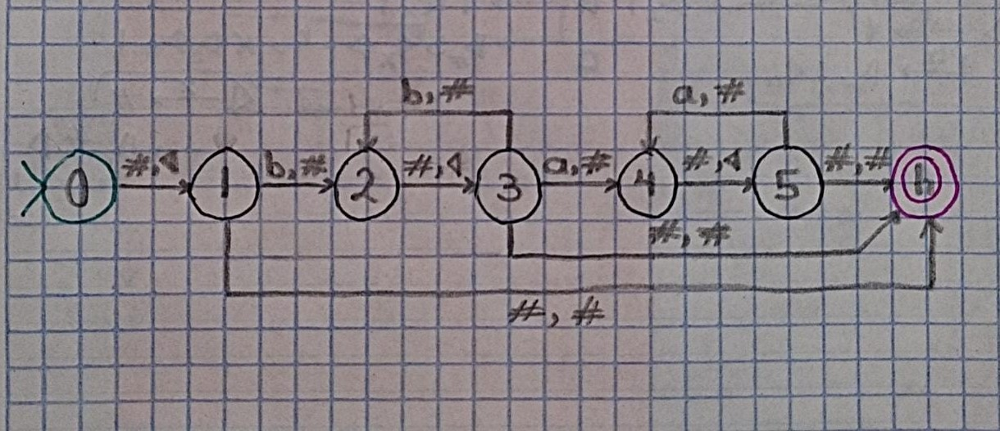
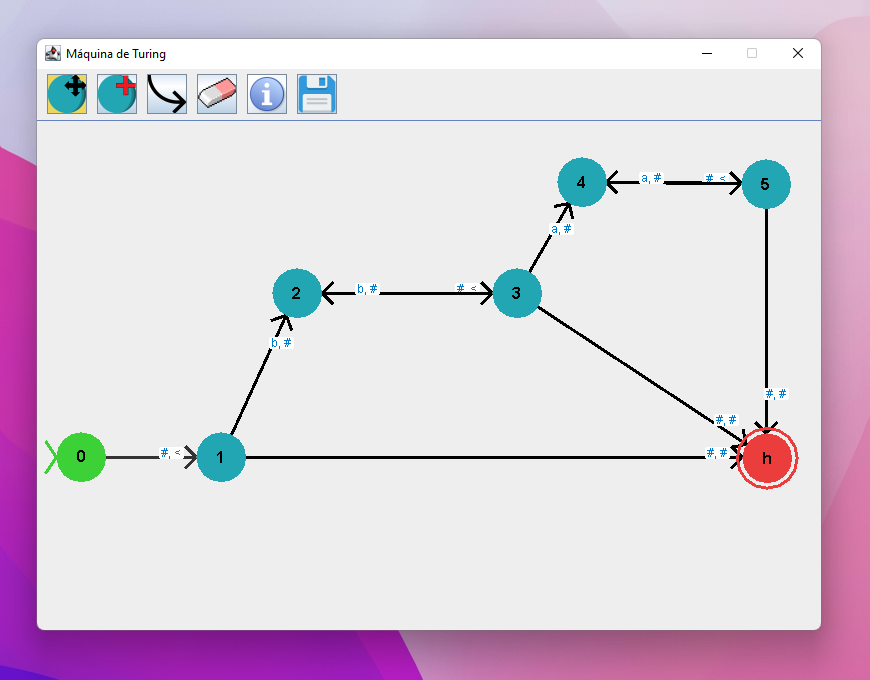
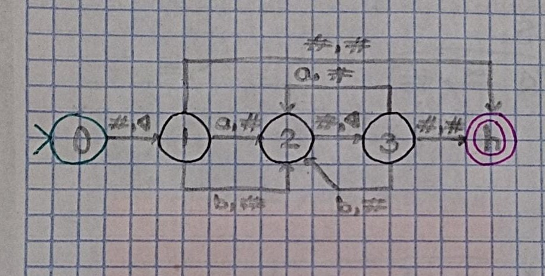
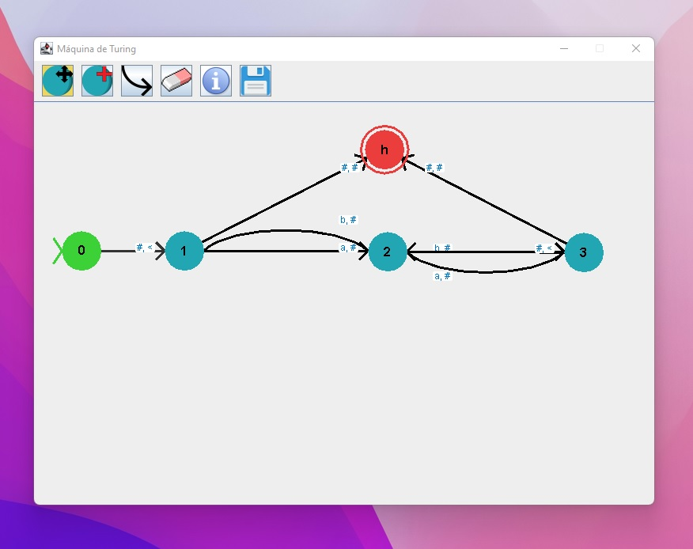

**Interfaz Gráfica para Máquinas de Turing**

---

**Algunos Conceptos Básicos**

**Lenguajes Formales:**
Los lenguajes formales son esenciales en ciencias de la computación y matemáticas para describir patrones y estructuras. Proporcionan una manera precisa de definir conjuntos de cadenas sobre un alfabeto dado. Estos lenguajes se utilizan en diversas áreas de la informática, incluido el diseño de compiladores, la inteligencia artificial y la criptografía.

**Autómatas:**
Los autómatas son modelos matemáticos abstractos utilizados para describir la computación. Consisten en estados, transiciones y símbolos de entrada. Los autómatas finitos, los autómatas de empuje y las máquinas de Turing son ejemplos de autómatas utilizados para reconocer diferentes clases de lenguajes.

**Máquinas de Turing:**
Las máquinas de Turing son un concepto fundamental en la teoría de la computabilidad y la teoría de la computación. Son dispositivos teóricos que manipulan símbolos en una cinta infinita según un conjunto de reglas. Las máquinas de Turing pueden simular cualquier proceso algorítmico y se utilizan para comprender los límites de la computabilidad.

---

**Descripción:**

Esta aplicación es un Simulador de Máquinas de Turing, que permite a los usuarios diseñar visualmente Máquinas de Turing. Proporciona una interfaz gráfica intuitiva para que los usuarios creen estados y transiciones de Máquinas de Turing.

**Por qué es Útil una Herramienta para Lenguajes Formales y Autómatas:**
Entender los lenguajes formales y la teoría de los autómatas es crucial para estudiantes y profesionales en ciencias de la computación y campos relacionados. Sin embargo, diseñar autómatas manualmente puede ser consumir mucho tiempo.

La herramienta que desarrollé proporciona una interfaz fácil de usar para diseñar y analizar autómatas. Permite a los usuarios crear máquinas de Turing sin esfuerzo.

Al simplificar el proceso de trabajo con autómatas y lenguajes formales, esta herramienta permite a los usuarios centrarse más en comprender los conceptos subyacentes y explorar sus aplicaciones en diversos campos de la informática. Ya sea que seas un estudiante que aprende teoría de autómatas por primera vez o un investigador que investiga nuevos modelos computacionales, esta herramienta proporciona un recurso valioso para experimentar y aprender.

---

**Características:**

1. **Interfaz Gráfica:** La aplicación cuenta con una interfaz gráfica donde los usuarios pueden diseñar visualmente Máquinas de Turing. La ventana principal consta de un panel de dibujo donde se muestran los estados y las transiciones.

2. **Gestión de Estados:** Los usuarios pueden agregar, eliminar y mover estados en el panel de dibujo. Los estados están representados por nodos circulares, y los usuarios pueden interactuar con ellos para definir sus propiedades.

3. **Creación de Transiciones:** Los usuarios pueden crear transiciones entre estados especificando los símbolos de lectura y escritura, así como la dirección del movimiento. Las transiciones están representadas por flechas entre estados.

4. **Guardar:** Los usuarios pueden guardar sus diseños de Máquinas de Turing en un archivo (donde se describen todos los estados y transiciones) para su uso posterior.

---

**Cómo Usar:**

Esta es la apariencia de la barra de herramientas.

**Las acciones disponibles se enumeran en el orden en que aparecen en la pantalla.**

1. **Mover:** Haz clic en el botón "Círculo de Mover" para mover cualquier estado existente en el panel de dibujo. Los estados están representados por nodos circulares.

2. **Agregar Estados:** Haz clic en el botón "Círculo de Agregar" para agregar un nuevo estado al panel de dibujo. Los estados están representados por nodos circulares.

3. **Crear Transiciones:** Haz clic en el botón "Flecha" para crear transiciones entre estados. Especifica los símbolos de lectura y escritura, así como la dirección del movimiento.

4. **Eliminar Estados:** Usa el botón "Borrador" para eliminar estados o transiciones.

5. **Establecer/Editar Valores de Transición:** Haz clic en el botón "Información", luego haz clic en el estado cuyas transiciones necesitan ser cambiadas para entrar en modo de edición.

6. **Guardar:** Usa los botones "Guardar" y "Cargar" para guardar el diseño de tu Máquina de Turing en un archivo o cargar un diseño previamente guardado.

---

**Ejemplos: (Hechos a Mano/Hechos por Software/Salida)**

<table>
  <tr>
    <td></td>
    <td></td>
    <td><pre><code></code>0,#,1,i
1,b,2,#
2,#,3,i
3,b,4,i
4,a,5,i
5,#,6,d
6,a,7,#
7,#,8,d
8,a,9,d
9,b,10,d
10,#,11,i
11,b,2,#
4,b,4,i
5,a,5,i
10,b,10,d
9,a,9,d
8,#,h,#
3,a,5,i</pre></td>
  </tr>
  <tr>
    <td></td>
    <td></td>
    <td><pre><code></code>0,#,1,i
1,b,2,#
1,#,h,#
2,#,3,i
3,b,2,#
3,#,h,#
3,a,4,#
4,#,5,i
5,#,h,#
5,a,4,#
</pre></td>
  </tr>
  <tr>
    <td></td>
    <td></td>
    <td><pre><code